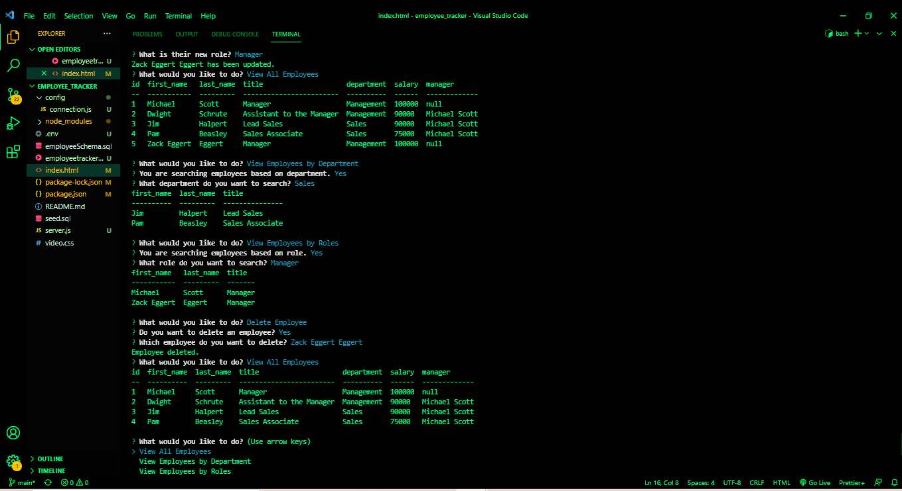

# employee tracker
  
  

  ## Descrription
  This application allows for easy organization of employees, departments, and roles that make up a company or organization. Using hardcoded schemas in MySQL database, clients can easily view current employees by department or position as well as access an overview of the entire employee roster. Clients can also easily add employees, departments, and positions but running a simple node process and answer prompts to generate seeds to be added to the database, as well as remove individual employees.

  ## Table of Contents
  -[Description](#description)

  -[Installation](#installation)

  -[Usage](#usage)

  -[License](#license)

  -[Contributions](#contributions)

  -[Tests](#tests)

  -[Questions](#questions)

  ## Installation
  Clients will need to install inquirer.js, mysql, and console.tables

  ## Usage
  node index will intial prompts to begin interacting with the database

  ## License
  Copyright (C) 2021 Zachary Eggert

  This project is licensed under the MIT license.

  https://opensource.org/licenses/MIT

  ## Contributions
  Zachary Eggert

  ## Tests
  

  ## Questions
  For any questions you can reach me at:
  zreggert@gmail.com

  Also please check out this application's repo and my other work at:
  https://github.com/zreggert

